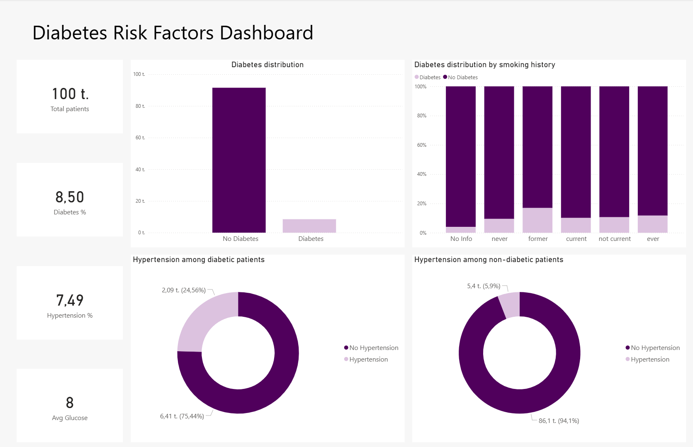

# Diabetes risk factor analysis

This project analyzes key risk factors associated with diabetes using real-world health data.

The workflow includes data cleaning in Python, exploratory analysis in Jupyter Notebook and dashboards built with Power BI and Streamlit.

The analysis shows the hypertension is significantly more common among diabetic individuals and higher HbA1c and blood glucose levels are strongly associated with diabetes.

